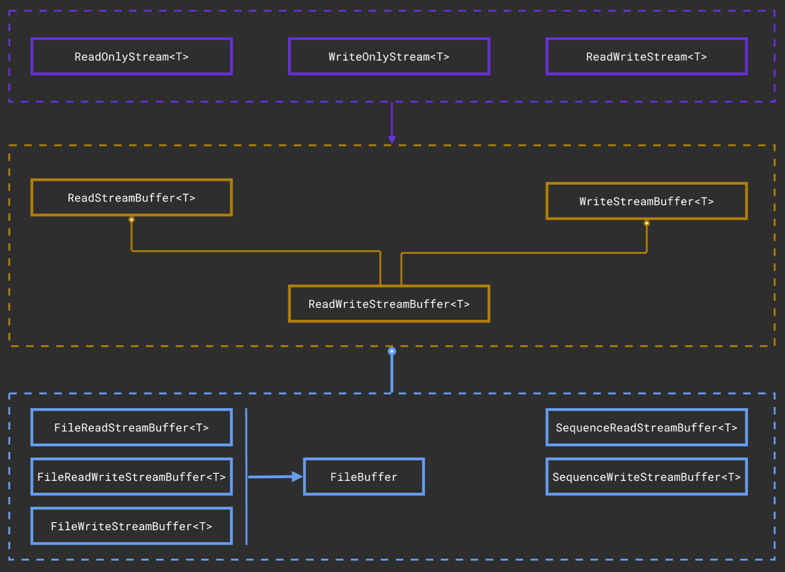

# cpp-stream-library

Гибкая, типобезопасная и эффективная потоковая библиотека ввода-вывода, созданная на C++ в рамках университетской лабораторной работы.

## О проекте

Это учебный проект, целью которого является создание собственной библиотеки потокового ввода-вывода с нуля, вдохновленной принципами стандартных библиотек `<iostream>` и `<fstream>`.

Ключевая идея — построение гибкой, многоуровневой архитектуры, которая разделяет низкоуровневую работу с байтами и высокоуровневое объектно-ориентированное управление потоками. Такой дизайн позволяет библиотеке работать с различными источниками данных (такими как файлы или коллекции в памяти) через единый, унифицированный интерфейс.

### Ключевые особенности

*   **Полиморфный дизайн**: Позволяет работать с различными источниками данных (файлы, `std::vector` и т.д.) через общий абстрактный интерфейс.
*   **Типобезопасные потоки**: Разделение иерархий для операций только для чтения (`ReadOnlyStream`) и только для записи (`WriteOnlyStream`) для предотвращения логических ошибок на этапе компиляции.
*   **Эффективный ввод-вывод**: Используется низкоуровневый `FileBuffer` с собственной логикой `overflow()` и `underflow()` для минимизации дорогостоящих системных вызовов.
*   **Пользовательская сериализация**: Использует `std::function`, чтобы позволить пользователям предоставлять собственную логику сериализации и десериализации для любого типа данных.
*   **Современный C++**: Использование принципов современного C++, включая RAII, умные указатели (`std::unique_ptr`) и семантику перемещения для надежного управления ресурсами.

## Архитектура проекта

Библиотека спроектирована с четкой 4-уровневой архитектурой:

*   **Уровень 4: Пользовательский API (`streams`)**: Высокоуровневые классы (`ReadOnlyStream`, `WriteOnlyStream`), предоставляющие простой интерфейс с операторами `>>` и `<<` для конечного пользователя.
*   **Уровень 3: Конкретные "движки" (`io`)**: Конкретные реализации, которые адаптируют различные источники данных (файлы, последовательности) к абстрактным интерфейсам.
*   **Уровень 2: Абстрактные интерфейсы (`core`)**: Набор абстрактных классов (`ReadStreamBuffer`, `WriteStreamBuffer`), которые определяют контракт для любого потокового источника данных.
*   **Уровень 1: Низкоуровневая утилита (`utils`)**: Низкоуровневый класс `FileBuffer`, который обрабатывает прямое буферизованное взаимодействие с `FILE*`.

## Иерархия классов:


## Пример использования

Пример использования библиотеки для записи пользовательских объектов в файл и их последующего чтения.

```cpp
#include <iostream>
#include <vector>
#include "streams/ReadOnlyStream.h"
#include "streams/WriteOnlyStream.h"
#include "io/file/FileReadStreamBuffer.h"
#include "io/file/FileWriteStreamBuffer.h"

// 1. Определяем пользовательскую структуру данных
struct User {
    uint32_t id;
    char name[32];
};

int main() {
    const std::string filename = "users.dat";

    // --- Запись в файл ---
    {
        // Создаем поток только для записи, передавая лямбда-функцию сериализатора
        WriteOnlyStream<User> out_stream(
            new FileWriteStreamBuffer<User>(filename, 
                [](FileBuffer& buf, const User& u) {
                    const char* user_bytes = reinterpret_cast<const char*>(&u);
                    for (size_t i = 0; i < sizeof(User); ++i) {
                        buf.put_char(user_bytes[i]);
                    }
                }
            )
        );

        std::cout << "Записываем пользователей в " << filename << "..." << std::endl;
        out_stream << User{1, "Alice"} << User{2, "Bob"};
        // Файл автоматически сбрасывается на диск и закрывается деструктором потока
    }

    // --- Чтение из файла ---
    {
        // Создаем поток только для чтения, передавая лямбда-функцию десериализатора
        ReadOnlyStream<User> in_stream(
            new FileReadStreamBuffer<User>(filename,
                [](FileBuffer& buf) -> User {
                    User u;
                    char* user_bytes = reinterpret_cast<char*>(&u);
                    for (size_t i = 0; i < sizeof(User); ++i) {
                        int byte = buf.get_char();
                        if (byte == -1) throw std::runtime_error("Неожиданный конец файла");
                        user_bytes[i] = static_cast<char>(byte);
                    }
                    return u;
                }
            )
        );

        User temp_user;
        std::cout << "Читаем пользователей из " << filename << ":" << std::endl;
        while (in_stream >> temp_user) {
            std::cout << "ID: " << temp_user.id << ", Имя: " << temp_user.name << std::endl;
        }
    }

    return 0;
}
```
